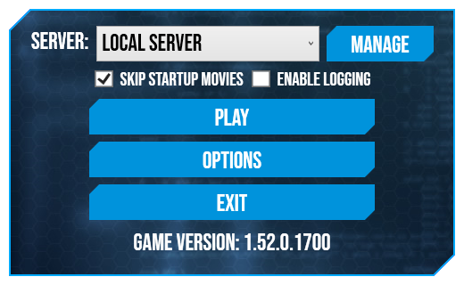

# Bifrost

Bifrost is a custom launcher for Marvel Heroes. It consists of three main parts:

- Bifrost.Launcher - a backend library.

- Bifrost.ConsoleApp - a very simple example program that demonstrates how to use Bifrost.Launcher.

- Bifrost.Wpf - a WPF-based graphical interface that uses Bifrost.Launcher.

## Features

* Game version detection.

* Gazillion launcher / Steam bypass.

* Connection to different servers without modifying ClientConfig.xml.

* Various logging options for development.

* Advanced options that expose some hidden client functionality.

## Installation

1. Make sure you have [.NET Runtime 6.0](https://dotnet.microsoft.com/en-us/download/dotnet/6.0) installed.

2. Extract Bifrost.Wpf.exe and other files to your Marvel Heroes installation directory (the one that has Data and UnrealEngine3 folders).

3. Run Bifrost.Wpf.exe.

Downloading a precompiled release may trigger false positives from some antivirus software due to how Bifrost functions (file scanning and launching other executables). If this makes you anxious, feel free to build the source code yourself.

## Requirements

Bifrost.Launcher and Bifrost.Console are cross-platform and should be buildable on any .NET supported platforms. Bifrost.Wpf relies on WPF and requires Windows or compatible environment.
