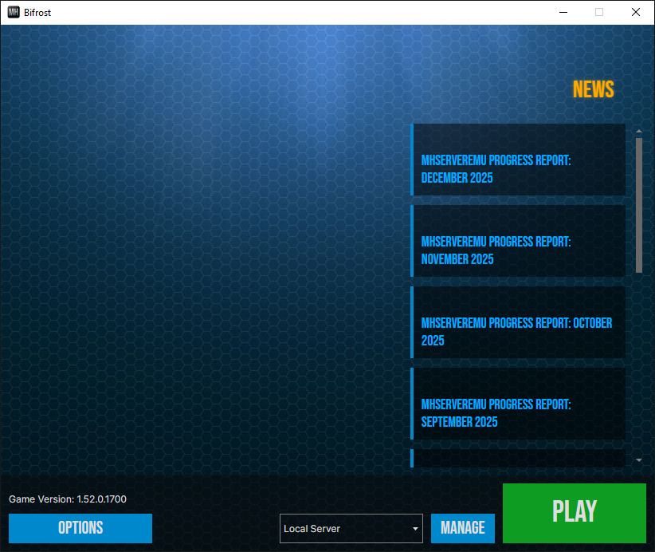

# Bifrost

Bifrost is a custom launcher for Marvel Heroes. 

## Features

* Launching the game client.

* Managing settings for connecting to different servers.

* Customizable RSS/Atom based news feed.

* Configuration of hidden client options (e.g. custom resolution, auto-login).

* Theme support with themes inspired by the original Gazillion launcher.

## Installation

1. Download the latest release [here](https://github.com/Crypto137/Bifrost/releases).

2. Extract to your Marvel Heroes installation directory.

3. Run Bifrost.exe.

**NOTE: Bifrost is an unsigned executable that starts another process. This may cause false positive detections from various antivirus and antimalware software. If this causes inconvenience, please feel free to build the source code yourself.**
